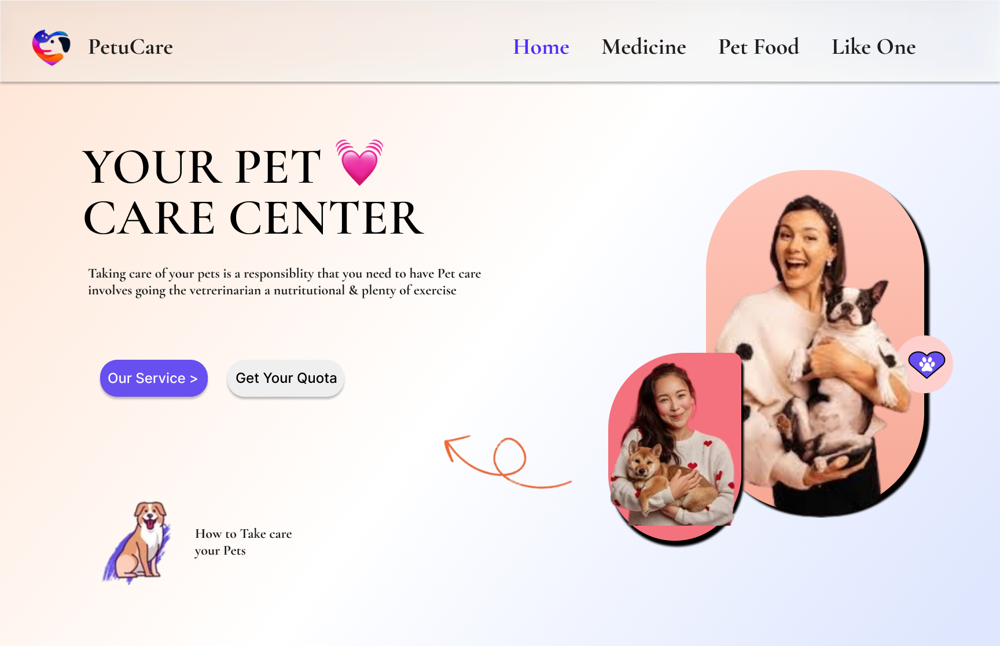
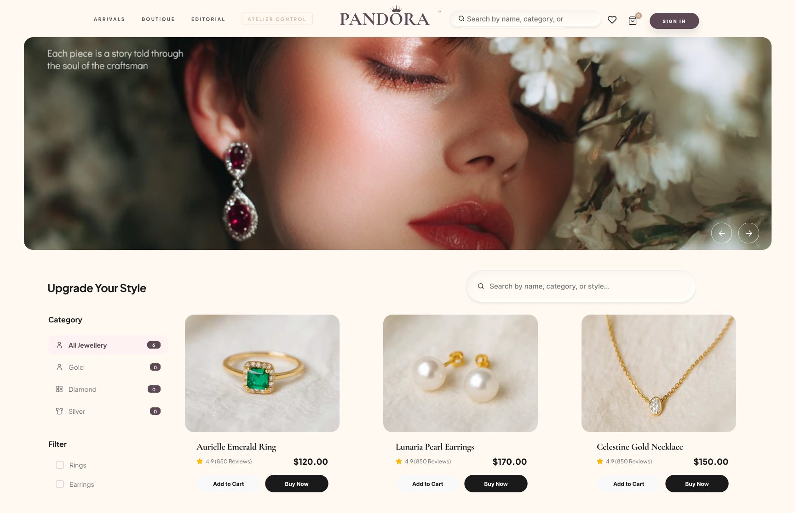

<!-- Typing Animation -->

  

---

## 👨‍💻 About Me

🚀 **Full Stack Developer** with hands-on experience building **scalable, production-ready web applications**  
🎨 Passionate about **UI/UX design, frontend motion, and performance optimization**  
🧠 Active **problem solver** on LeetCode (**230+ problems solved**)  
⚙️ Comfortable working across **frontend, backend, and databases**  

---

## 🧠 Tech I Work With

  

---

## 📊 GitHub Analytics

  
  

---

## 🚀 Featured Projects

<table>
<tr>

<td width="50%" valign="top">

### 🧠 StyLux AI  
AI-powered fashion assistant focused on smart outfit recommendations and modern user experience.

  
  

</td>

<td width="50%" valign="top">

### 👗 TryFit  
Digital fashion & styling platform delivering premium shopping and virtual styling experiences.

  
  

</td>

</tr>

<tr>

<td width="50%" valign="top">

### 🍇 ClickIn  
Fast and seamless grocery delivery platform built for smooth ordering and doorstep convenience.

  
  

</td>

<td width="50%" valign="top">

### 🚀 Building More Experiences  
Continuously crafting modern digital products with focus on UI/UX, scalability, and innovation.

  
  

</td>

</tr>
</table>

---
##  LeetCode Analytics

  

---

##  Figma Community Showcase

<table>
<tr>

<td width="50%" valign="top">

### 🐾 Pet Care UI Design

Clean and elegant pet care landing page focused on modern UI, soft aesthetics, and user-friendly interactions.

 

  

</td>

<td width="50%" valign="top">

### 💎 Pandora Jewelry UI

Luxury-inspired jewelry eCommerce design showcasing premium visuals, elegant layouts, and refined shopping experience.

 

  

</td>

</tr>
</table>

---

## 🚀 Entrepreneur Mindset

> *" Launch fast. Learn faster. Improve constantly. Scale relentlessly. "*

---

## 🌐 Connect With Me

  
  
  
  
  
  
  

---

  <b>🚀 Let’s build something impactful together!</b>

